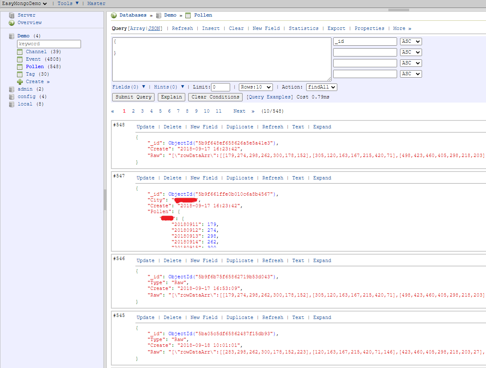

# EasyMongo
MongoDB Web管理应用，本项目基于[RockMongo](https://github.com/iwind/rockmongo)，使用最新的[mongodb扩展](https://pecl.php.net/package/mongodb) + [mongo-php-library](https://github.com/mongodb/mongo-php-library)模式，支持Mongodb3.0+，以及php5.6以上所有版本。

## 广泛的版本支持
MongoDB: 3.0及以上所有版本

PHP: php5.6, php7.x, php8.x

## 丰富的功能
* 便捷的增删改查操作
* 索引增删查操作
* 数据库/复制集状态监控
* 数据导入导出
* 查询性能优化

## 安装方法
首先确保已经安装了mongodb扩展，然后执行如下命令：
~~~
git clone https://github.com/pkuoliver/EasyMongo.git
~~~
然后用[Composer](https://getcomposer.org/)安装mongo-php-library
~~~
composer require mongodb/mongodb
~~~
复制配置文件
~~~
cp config.sample.php config.php
~~~
修改相关配置，就可以开始使用啦。

## 语言支持
本项目支持英语，汉语，日语，法语，德语，俄语，西班牙语，意大利语，土耳其语，葡萄牙语。

## UI预览

查看更多预览图，请访问[sceenshots目录](./screenshots/)

## 致谢
[Liu Xiaochao/iwind](https://github.com/iwind)

[lxp_kidd/lxphelloworld](https://github.com/lxphelloworld)